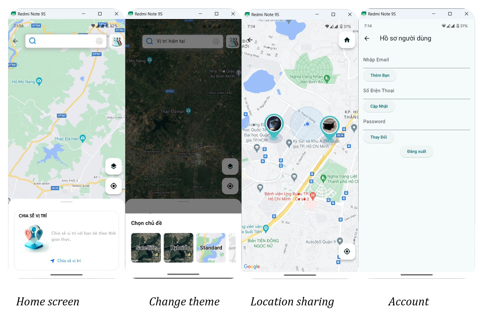
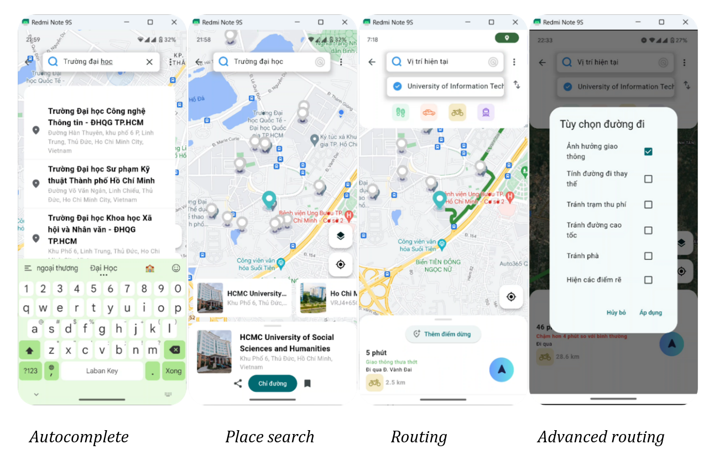
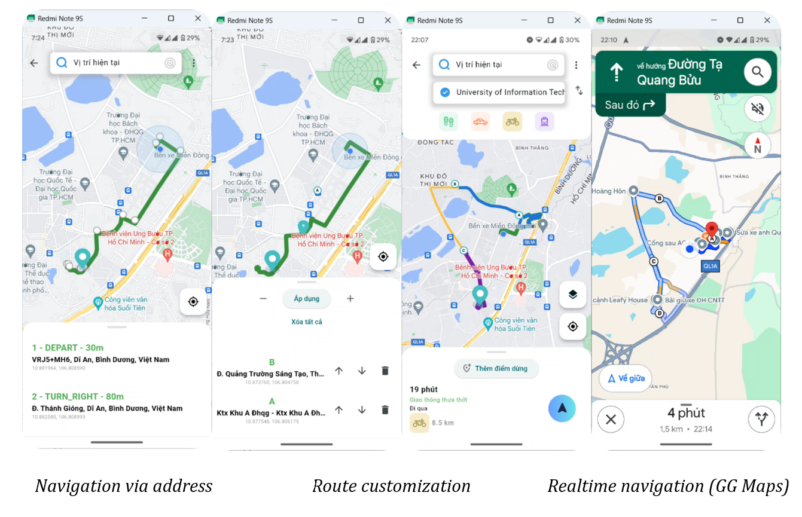

# Flutter Maps Project

This project is a comprehensive Flutter application designed to enhance navigation and location-based services. It integrates advanced features such as location search, detailed information on places, route planning, route customization, real-time navigation, and location sharing. By leveraging the capabilities of Flutter and Google Maps SDK, along with Firebase for backend services, this app offers a seamless and interactive experience for users on both Android and iOS platforms.

## Features

- **Location Search**: Quickly find places with a robust search feature, powered by Google Maps.
- **Information on Locations**: Access detailed information about places, including reviews, ratings, and photos.
- **Route Planning**: Plan your journey with customizable routes, considering different modes of transportation.
- **Route Customization**: Tailor your route by adding multiple stops or avoiding specific paths.
- **Real-Time Navigation**: Navigate with real-time updates on traffic, directions, and ETA.
- **Location Sharing**: Share your current location or planned routes with friends and family for coordinated travel.

## Technologies Used

- **Flutter**: A UI toolkit for crafting natively compiled applications for mobile, web, and desktop from a single codebase.
- **Google Maps SDK for Flutter**: Integrates Google Maps with Flutter applications, providing a wide range of mapping features.
- **Firebase**: A platform developed by Google for creating mobile and web applications, used here for backend services including authentication, database, and hosting.

## Platforms

- **Android**: Fully supported, with extensive testing on various devices to ensure compatibility and performance.
- **iOS**: Currently in development.

## Getting Started

To get started with this project, ensure you have Flutter installed on your development machine. For detailed instructions, refer to the [Flutter official documentation](https://flutter.dev/docs/get-started/install).

### Prerequisites

- Flutter SDK
- Android Studio or Visual Studio Code with Flutter and Dart plugins installed
- An active Firebase project for backend services
- A Google Cloud Platform project with the Maps SDK and Places API enabled

### Setup

1. Clone the repository to your local machine.
2. Open the project in your preferred IDE (Android Studio/VS Code).
3. Configure your Firebase project (Place the `firebase.json` file in the root directory of the project) and download the `google-services.json` for Android or `GoogleService-Info.plist` for iOS, placing it in the respective directory (For android is `android\app\`).
4. Enable the necessary APIs (Maps SDK, Places API) in your Google Cloud Platform project and obtain an API key.
5. Open the `local.properties` file in the `android` directory of the project and add the following line to the file: `MAPS_API_KEY1=YOUR_API_KEY`, replacing `YOUR_API_KEY` with your actual API key.

6. Insert your API key from above to the appropriate location within the app (usually in the Android manifest or iOS plist file).

This API key only use for Geolocation
```xml
<application
    ...
    <meta-data
        android:name="com.google.android.geo.API_KEY"
        android:value="${MAPS_API_KEY1}" />
    ...
</application>
```

For other RESTful Maps API, use this to insert to the request url: `
dotenv.env['MAPS_API_KEY1']
`

Example:
```dart
final response = await http.get(Uri.parse(
      'https://places.googleapis.com/v1/places/${placeID}?fields=photos&key=${dotenv.env['MAPS_API_KEY1']}'));
```

7. Run `flutter pub get` to install all the dependencies.
8. Build and run the app on your device or emulator.

## Screenshot






## Contribution

Contributions are welcome! If you have ideas for improvements or bug fixes, please feel free to fork the repository and submit a pull request.

## License

This project is licensed under the MIT License - see the LICENSE file for details.
